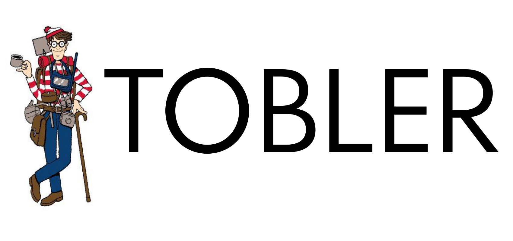

<p align="center">

</p>

[](https://travis-ci.org/pysal/tobler)
[](https://coveralls.io/github/pysal/tobler?branch=master&service=github&kill_cache=1)


[](https://zenodo.org/badge/latestdoi/202220824)

Tobler is a python package for areal interpolation, dasymetric mapping, and change of support.
<p></p>


`tobler` provides:

* areal interpolation for intensive and extensive variables	
* use raster files to improve interpolation accuracy
    + areal interpolation assuming data should only be allocated to specific land types
    + model-based interpolation using [regression](https://github.com/spatialucr/tobler/blob/master/examples/vectorized_raster_example.ipynb) approaches that incorporates auxiliary data
* Much more to come!


**Easily convert geospatial data from one polygonal representation to another:**


**Improve conversion accuracy by incorporating raster image data from satellites:**


## Installation

```bash
$ conda env create -f environment.yml
$ conda activate tobler 
$ python setup.py develop
```

Contribute
----------

PySAL-tobler is under active development and contributors are welcome.

If you have any suggestion, feature request, or bug report, please open a new [issue](https://github.com/pysal/tobler/issues) on GitHub. To submit patches, please follow the PySAL development [guidelines](http://pysal.readthedocs.io/en/latest/developers/index.html) and open a [pull request](https://github.com/pysal/tobler). Once your changes get merged, you’ll automatically be added to the [Contributors List](https://github.com/pysal/tobler/graphs/contributors).


License
-------

The project is licensed under the [BSD license](https://github.com/pysal/tobler/blob/master/LICENSE.txt).


Funding
-------

 

Award #1733705 [Neighborhoods in Space-Time Contexts](https://www.nsf.gov/awardsearch/showAward?AWD_ID=1733705&HistoricalAwards=false)

 Award #1831615 [Scalable Geospatial Analytics for Social Science Research](https://www.nsf.gov/awardsearch/showAward?AWD_ID=1831615)
