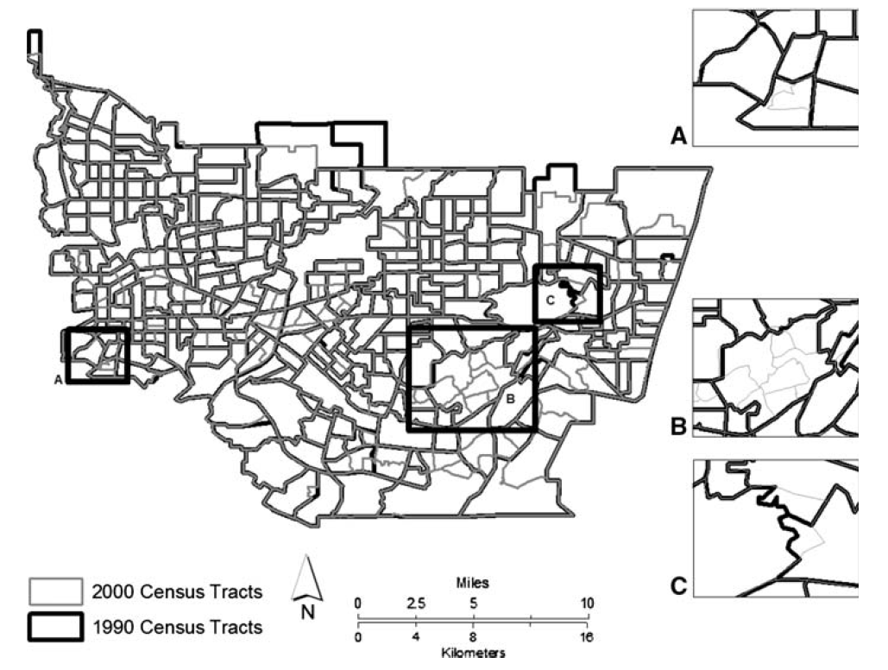

# tobler: a library for spatial interpolation in Python

**Easily perform area interpolation for different set of set of polygons:**



**Perform enhanced interpolation using raster image files from satellites:**


## Roadmap

* TODO r-tree or binning for indexing and table generation
* TODO allow for weights parameter
* TODO hybrid harmonization
* TODO union harmonization
* TODO nlcd auxiliary regressions


## Installation

```bash
$ conda env create -f environment.yml
$ conda activate tobler 
$ python setup.py develop
```
